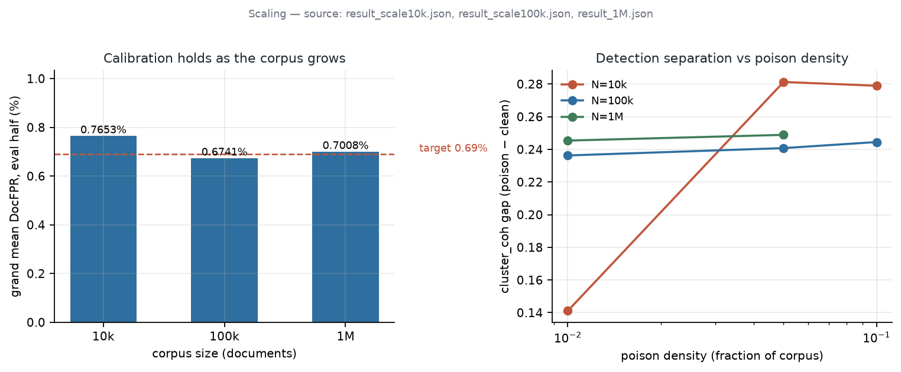
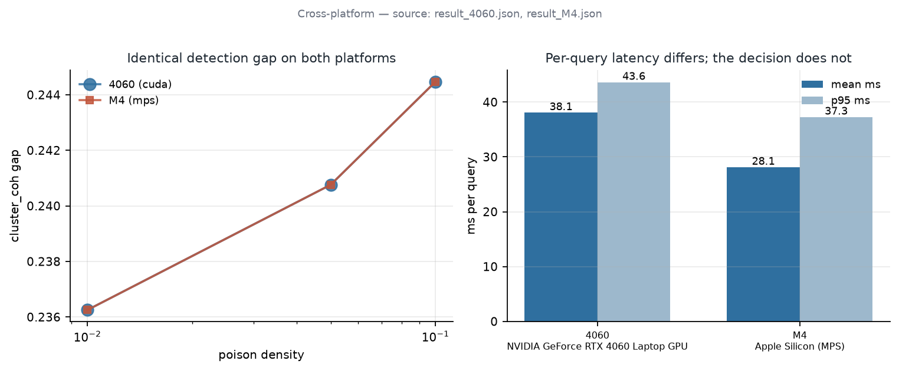
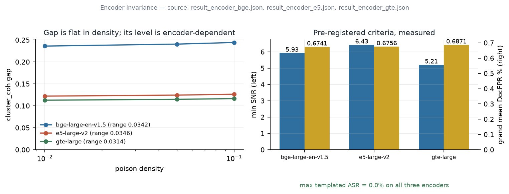
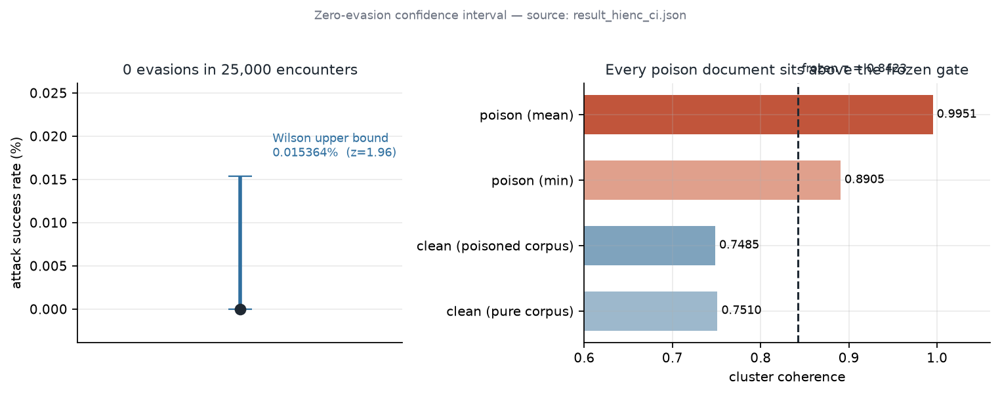

# SEVA: Lightweight, LLM-Free Detection of Templated Corpus Poisoning in RAG

[](https://github.com/varadharajanv0310/SEVA-RAG/actions/workflows/ci.yml)
[](LICENSE)

**SEVA** is a fully local, **LLM-free** detector of corpus-poisoning attacks against
Retrieval-Augmented Generation (RAG). It detects the dominant published attack pattern —
**templated, multi-passage injection** (PoisonedRAG) — using a single geometric signal,
operated as a hard gate, with **no LLM call, no external API, and no cryptographic
pre-registration**.

The signal is **`cluster_coh`**: for each document `d`, the mean pairwise cosine similarity
among its `K=5` nearest neighbours **in the corpus** embedding space. Templated poison is
anomalous because the passages injected for one target query form a *tight, mutually-similar
cluster* — a geometric signature intrinsic to the attack's own mechanism. SEVA flags a
document when `cluster_coh > τ`, with `τ` calibrated **non-oracle** (no labelled poison, no
knowledge of contamination density) to a universal false-positive target of **0.69%**, and
flags a *query* when ≥ 2 of its retrieved documents are flagged.

> The paper is `SEVA_v8.tex` (+ `SEVA_v8_supp.tex`). This repository contains the frozen
> detector, the deterministic reproduction toolkit, and the result files behind every
> headline number (see [RESULTS.md](RESULTS.md)).

---

## Headline results

All under **frozen, non-oracle** calibration. Primary corpus: an in-domain Security Stack
Exchange Q&A corpus of 100,000 deduplicated documents (a *domain-confound control* — clean
and poison share the same domain, so a detector cannot exploit topic contrast).

| Result | Number | Where |
|---|---|---|
| In-domain templated poison-evasion (3 seeds, 1–10% density) | **0%** (95% Wilson ≤ **0.0154%**, 25k encounters) | `tab:main` |
| In-domain document false-positive rate | **0.58%** frozen / 0.56% grand-mean | `tab:main` |
| Cross-domain catch of **released** PoisonedRAG | **82%** (NQ) / **97%** (HotpotQA) / **98%** (Security black-box) | `tab:xdomain` |
| Lexical (MinHash) filtering on duplicate-rich corpora | **0%** below 2% FPR (corpus-fragile) | `tab:roc` |
| 10-signal composite under adaptive attack vs the hard gate | **42–72%** / **49–57%** evasion vs **0%** | `tab:main` / `tab:core` |
| Encoder-invariance (bge / e5 / gte, independent lineages) | **0%** evasion on all three | `tab:encoder` |
| Cross-platform reproduction (RTX 5080 / RTX 4060 / Apple M4) | identical detection; gap agrees to **< 5×10⁻⁷** | `tab:xplat` |
| Scale to 1,000,000 documents | **0%** evasion, 0.70% FPR, **15.0 ms**/query (retrieval+gate sub-ms) | `tab:scale` |
| Head-to-head vs per-query SoTA (RAGDefender), matched ~0.8% FPR | SEVA **100%** vs **~89%** | `tab:h2h` |
| Per-query latency (desktop GPU → laptop GPU → Apple Silicon) | **13–38 ms**, no LLM / API | `tab:xplat` |

The 10-signal composite is reported only as an **ablation**: it is domain-confounded and
collapses under a keyword-dropping adversary, whereas the geometric hard gate — reading only
embedding geometry — holds 0%. The two composite-collapse figures are *distinct measurements*:
**42–72%** is the cost of *ablating* the soft signals from the detector (`tab:main` L2/L3
tiers); **49–57%** is the composite under an attack that *neutralizes the feature values*
(`tab:core`). See §V of the paper.

---

## Results

The figures below are generated from the committed result JSONs in `reproduction/`
by [`reproduction/make_figures.py`](reproduction/make_figures.py). Nothing is
hardcoded — re-running the script after a re-run of the experiments reproduces them
exactly:

```bash
python reproduction/make_figures.py
```

### Scaling



*Source: `reproduction/result_scale10k.json`, `result_scale100k.json`, `result_1M.json`.*

Left: `scale_summary.grand_mean_docfpr_eval_pct` at each corpus size against the
0.69% pre-registered target — 0.7653% at 10k, 0.6741% at 100k, 0.7008% at 1M. The
deviation does not grow with N, which is the claim the scale study was run to test.

Right: the cluster-coherence gap per poison density, averaged over seeds. The 100k
and 1M curves are flat, and **the 10k curve is not** — it collapses to 0.141 at 1%
density, and `result_scale10k.json` records `gap_density_invariant: false` and
`templated_asr_zero: false` accordingly. Density invariance is a large-corpus
property; the figure shows where it fails rather than cropping it out.

### Cross-platform agreement



*Source: `reproduction/result_4060.json`, `reproduction/result_M4.json`.*

The same corpus and poison set (both hash-verified against the reference SHA-256)
on an RTX 4060 under CUDA and an Apple M4 under MPS. The gap-per-density curves are
indistinguishable at plot resolution — they agree to within 1e-6. Per-query latency
is where the platforms actually differ: 38.1 ms mean on the 4060 versus 28.1 ms on
the M4. The decision is a property of the geometry, not of the accelerator.

### Encoder invariance



*Source: `reproduction/result_encoder_bge.json`, `result_encoder_e5.json`, `result_encoder_gte.json`.*

Three independent encoder lineages on shared axes. The honest reading has two
parts. Each encoder is **flat in density** — relative gap ranges of 0.0342, 0.0346
and 0.0314 — and all three clear the pre-registered bar with 0% max templated ASR.
But the absolute separation is **encoder-dependent**: bge sits near 0.24 while e5
and gte sit near 0.12 and 0.11. What generalises is that the gate works, not that
the margin is the same size everywhere.

### Zero-evasion confidence interval



*Source: `reproduction/result_hienc_ci.json`.*

0 evasions in 25,000 high-encounter trials. A point estimate of 0% is not by itself
informative, so the figure draws the 95% Wilson upper bound: **0.0154%**. The right
panel shows why the interval is that tight — every poison document sits above the
frozen threshold τ = 0.8423, with the minimum poison coherence at 0.8905 against a
clean mean of 0.7510. The threshold is not re-derived on the poisoned corpus; doing
so would inflate it to 0.9767, which the JSON records and the gate deliberately
does not use.

---

## Repository structure

```
SEVA-RAG/
├── SEVA_v8.tex                 # the paper (IEEEtran, ≤12 pp incl. references)
├── SEVA_v8_supp.tex            # supplementary material (confusion matrices, τ tables, capability comparison)
├── README.md  HOW_TO_REPRODUCE.md  RESULTS.md  LICENSE
├── requirements.txt  environment.yml  environment_5080.yml
│
├── reproduction/               # ── canonical reproduction toolkit (frozen) ──
│   ├── seva_xplat_common.py     #   frozen detector: cluster_coh + retrieval math, constants, hashing
│   ├── build_corpus_xplat.py    #   HF-revision-pinned, deterministic rebuild of the 100k corpus
│   ├── build_1m_corpus.py       #   deterministic 1M multi-site corpus build
│   ├── xplat_poison_gen.py      #   deterministic templated-poison generator (regenerates the exact 10k poison)
│   ├── hardgate_xrun.py         #   turnkey runner: build → hash-gate → embed → 3×3 grid + latency
│   ├── scale_xrun.py            #   10k / 100k calibration-scaling runner (Observation 2)
│   ├── scale1m_xrun.py          #   1M-document scale runner
│   ├── encoder_xrun.py          #   encoder-invariance runner (bge / e5 / gte)
│   ├── hienc_ci.py              #   high-encounter run (25k) for the Wilson upper bound
│   ├── encoder_config.py        #   encoder registry (model id, revision, prefix convention)
│   ├── PREREG_*.md  PROMPT_*.md  OPERATOR_GUIDE.md   # pre-registration + execution prompts
│   ├── MANIFEST.json            #   pinned HF revisions, encoder revision, canonical corpus hash, PASS checks
│   └── result_*.json            #   committed results (encoder, scale, 1M, cross-platform, calibration)
│
├── results/
│   ├── in_domain/              # primary in-domain grid (tab:main): 3 densities × 3 seeds (the headline 0%)
│   └── general_domain/         # general-domain baseline (the permissive-evaluation contrast)
│
├── whitebox_attack_results/    # curated headline attack experiments (tab:core / tab:h2h / tab:xdomain / tab:roc)
├── adaptive_attack_results/    # diversity-injection adaptive attack (SEVA holds 0%)
├── poison_corpus_diverse.json  # deterministic templated poison (10k docs)
├── *.py                        # the experiment scripts that produced the above (see HOW_TO_REPRODUCE.md)
└── legacy/                     # obsolete v5/v6 exploratory scripts (not used by the final detector)
```

The canonical, deterministic reproduction path lives in **`reproduction/`**. The remaining
root-level scripts are the broader experiment suite (cross-domain, head-to-head, adaptive
attacks); [RESULTS.md](RESULTS.md) maps each paper table to the script and result file behind it.

---

## Detector constants (frozen)

| Constant | Value | Meaning |
|---|---|---|
| `K` | 5 | nearest corpus neighbours for `cluster_coh` |
| `K_FETCH` | 20 | HNSW over-fetch, reranked to top-`K` |
| `EMB_DIM` | 1024 | embedding dimension (bge-large-en-v1.5, ℓ₂-normalized) |
| `INDEX_M` / `efConstruction` | 32 / 200 | FAISS HNSW parameters |
| `FPR_TARGET` | 0.0069 | universal non-oracle false-positive target (0.69%) |
| `k` (query aggregation) | 2 | flag a query when ≥ 2 retrieved docs are flagged |
| seeds | 42, 7, 123 | three calibration-partition seeds |
| calibration | 2000 benign queries, 60/40 cal/eval split | non-oracle: τ = (1 − FPR_TARGET) percentile of clean `cluster_coh` |

Encoder: **`BAAI/bge-large-en-v1.5`** (revision `d4aa6901d3a41ba39fb536a557fa166f842b0e09`).
The geometric signal is additionally validated across **e5-large-v2** (Microsoft) and
**gte-large** (Alibaba).

---

## Environment

Pinned versions of the primary (RTX 5080) runs:

| Package | Version |
|---|---|
| Python | 3.11.15 |
| torch | 2.11.0+cu128 (CUDA) |
| numpy | 1.26.4 |
| faiss | 1.7.4 |
| sentence-transformers | 3.0.1 |
| huggingface-hub | 0.24.2 |

Cross-platform reproduction additionally used torch 2.6.0+cu124 (RTX 4060) and torch 2.11.0
with the MPS backend (Apple M4) — detection is byte-identical across all three (see
`reproduction/result_{4060,M4}.json`). See `requirements.txt` / `environment.yml` for install,
and `reproduction/requirements_install.md` for per-platform notes.

```bash
git clone https://github.com/varadharajanv0310/SEVA-RAG.git
cd SEVA-RAG
conda env create -f environment.yml      # or: conda create -n seva python=3.11 && pip install -r requirements.txt
conda activate seva
```

---

## Reproduce in one command

From a clean environment, the headline in-domain result (hash-gated corpus → deterministic
poison → frozen hard gate → 3 densities × 3 seeds):

```bash
cd reproduction
python hardgate_xrun.py --label local
# Rebuilds the 100k corpus from pinned HF revisions and STOPS unless it matches the
# canonical order-sensitive SHA-256 (28ec3811…); regenerates the exact 10k poison
# (SHA-256 4f7ee3f3…); embeds once with bge-large; emits result_local.json with
# gap / SNR / 0% poison-evasion / Doc-FPR per condition + per-query latency.
```

See **[HOW_TO_REPRODUCE.md](HOW_TO_REPRODUCE.md)** for the full matrix (corpus build, poison
regeneration, cross-domain PoisonedRAG, encoder-invariance, 1M scale, head-to-head) with the
documented corpus/poison hashes for identity verification.

---

## Citation

```bibtex
@misc{seva2026,
  title  = {SEVA: Lightweight, LLM-Free Detection of Templated Corpus Poisoning in Retrieval-Augmented Generation},
  author = {V. Varadharajan},
  year   = {2026},
  url    = {https://github.com/varadharajanv0310/SEVA-RAG}
}
```

## License

[MIT](LICENSE)
